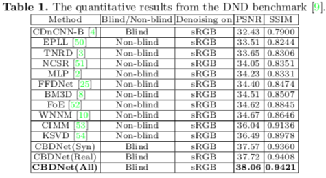

# [Toward Convolutional Blind Denoising of Real Photographs](https://arxiv.org/abs/1807.04686)

## Abstract
Despite their success in Gaussian denoising, deep convolutional neural networks (CNNs) are still very limited on real noisy photographs, and may even perform worse than BM3D. In order to improve the robustness and practicability of deep denoising models, this paper presents a convolutional blind denoising network (CBDNet) by incorporating network architecture, asymmetric learning and noise modeling. Our CBDNet is comprised of a noise estimation subnetwork and a denoising subnetwork. Motivated by the asymmetric sensitivity of BM3D to noise estimation error, the asymmetric learning is presented on the noise estimation subnetwork to suppress more on under-estimation of noise
level. To make the learned model applicable to real photographs, both synthetic images based on signal dependent noise model and real photographs with ground-truth images are incorporated to train our CBDNet. The results on two datasets of real noisy photographs clearly demonstrate the superiority of our CBDNet over the state-of-the-art denoisers in terms of quantitative metrics and perceptual quaility. The data, code and model will be publicly available.

## Network Structure

## Realistic Noise Model
Given a clean image `x`, the realistic noise model can be represented as:

))))

=n_s(\\textbf{x})+n_c)

Where `y` is the noisy image, `f(.)` is the CRF function which converts irradiance `L` to `x`. `M(.)` represents the function that convert sRGB image to Bayer image and `M^(-1)(.)` represents the demosaicing function.

If considering denosing on compressed images, 

)))))

## Testing
* "Test_Patches.m" is the testing code for small images or image patches. If the tesing image is too large (e.g., 5760*3840), we recommend to use "Test_fullImage.m"
*  "Test_fullImage.m" is the testing code for large images. 
*  "Test_Realistic_Noise_Model.m" is the testing code for the realistic noise mode in our paper. And it's very convinent to utilize [AddNoiseMosai.m](https://github.com/GuoShi28/CBDNet/blob/master/utils/AddNoiseMosai.m) to train your own denoising model for real photographs.

## CBDNet Models
* "CBDNet.mat" is the testing model for DND dataset and NC12 dataset for not considering the JPEG compression.
*  "CBDNet_JPEG.mat" is the testing model for Nam dataset and other noisy images with JPEG format.

## Real Images Denoising Results
### DND dataset
Following the guided of [DND Online submission system](https://noise.visinf.tu-darmstadt.de/).

### Nam dataset

## Requirements and Dependencies
* Matlab 2015b
* Cuda-8.0 & cuDNN v-5.1
* [MatConvNet](http://www.vlfeat.org/matconvnet/).

## Citation
on going

